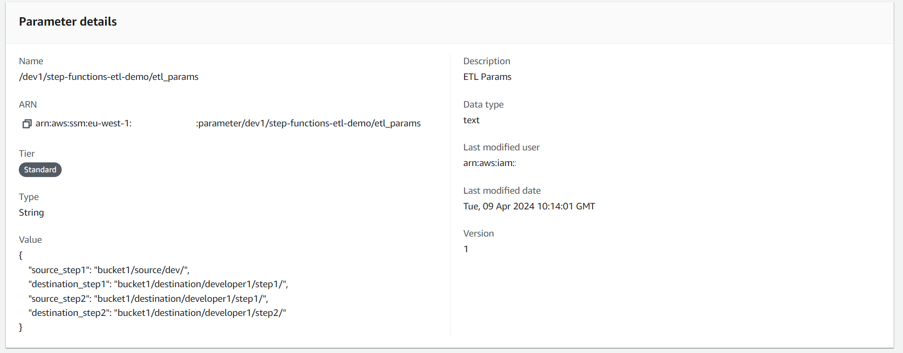

<!--
title: 'ETL Step Functions Example'
description: 'This template demonstrates how to deploy a multi-step ETL job using Step Functions using the Serverless Framework.'
layout: Doc
framework: v3
platform: AWS
language: python
priority: 2
authorLink: 'https://github.com/serverless'
authorName: 'Mark Hodnett'
authorAvatar: 'https://avatars1.githubusercontent.com/u/13742415?s=200&v=4'
-->


# Step Functions ETL Demo

This template demonstrates how to deploy a multi-step ETL job using Step Functions using the Serverless Framework. It also allows for multiple developers to work concurrently on different steps in the pipeline using stages. Each developer can deploy the stack independently, and their changes will not impact on other developers. Each deployment uses AWS Systems Manager Parameter Store to manage its parameters. In this example, we use it to store the source and destination locations for the data for each step in the pipeline.  
When deployed, this project creates the following resources:  
 - One Step Function
 - One Lambda function
 - One set of parameters in AWS Systems Manager Parameter Store
 - One Role to allow the Lambda functions to access the parameters

The parameter store config information, in this scenario it would be S3 locations:  



## Usage

### Deployment

In order to deploy the example, you need to run the following command:

```
$ serverless deploy --stage dev
```

After running deploy, you should see output similar to:

```bash
Deploying fourtheorem-create-data-lake to stage dev1 (eu-west-1)
✔ State machine "step_job" definition is valid

✔ Service deployed to stack fourtheorem-create-data-lake-dev1 (78s)

functions:
  step1: fourtheorem-create-data-lake-lambda-step1-dev1 (813 B)
```


### Creating the stacks and testing the functionality

Once you have deployed to stage ```dev```, it creates a step function for that stage called ```fourtheorem-create-data-lake-step-function-dev```. You can invoke the step function by using the following command:

```bash
aws stepfunctions start-execution --state-machine-arn arn:aws:states:eu-west-1:XXXXXXXXX:stateMachinefourtheorem-create-data-lake-step-function-dev --input '{}'
```
note: You must swap the XXXXXXXXX with the AWS account name. Alternatively, you can get the State Machine's ARN from the console

Which should result in response similar to the following:
```json
{
    "executionArn": "arn:aws:states:eu-west-1:XXXXXXXXX:execution:fourtheorem-create-data-lake-step-function-dev:11111111-2222-3333-4444-555555555555",
    "startDate": "2024-04-09T10:23:03.325000+00:00"
}
```

You can then see the results by taking the value for executionArn from above and copying into this command
```bash
aws stepfunctions describe-execution --execution-arn {executionArn}
```
e.g.
```bash
aws stepfunctions describe-execution --execution-arn arn:aws:states:eu-west-1:XXXXXXXXX:execution:fourtheorem-create-data-lake-step-function-dev:11111111-2222-3333-4444-555555555555
```
This should produce output similar to this:
```json
{
    "executionArn": "arn:aws:states:eu-west-1:XXXXXXXXX:execution:fourtheorem-create-data-lake-step-function-dev:11111111-2222-3333-4444-555555555555",
    "stateMachineArn": "arn:aws:states:eu-west-1:XXXXXXXXX:stateMachine:fourtheorem-create-data-lake-step-function-dev",
    "name": "64c84688-d97e-4277-b1e7-5a46e39112a5",
    "status": "SUCCEEDED",
    .........
}
```


## Cleanup
When done, run ```serverless remove``` for each stage you deployed, e.g.
```
$ serverless remove --stage dev
```
