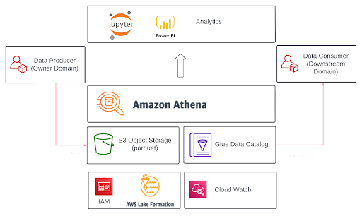
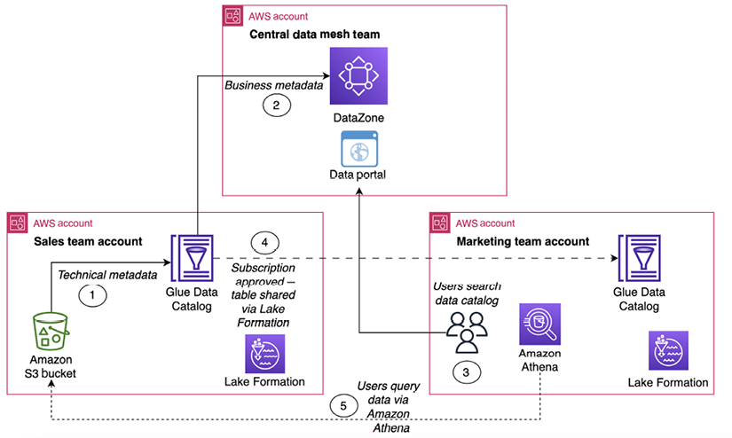

# Implementing a Data Mesh in AWS

notes: redo image, add layer descriptions, replace Power B.I., data consumer link to layer, include link from Jupyter to s3

- **Data Consumption layer**: The data consumption layer allows data consumers to access the data products through the whatever tools they are comfortable with, e.g. Business Intelligence tools such as Amazon QuickSight or Power B.I., SQL tools such as Amazon Athena or direct access to raw data from Jupyter notebooks.
- **Permissions**: Permissions is managed through AWS IAM (Identity and Access Management) and through AWS Lake Formation.
- **Monitoring and Observability**: Monitoring and Observability is managed through Amazon CloudWatch
- **Data Platform**: The data platform includes tools such as
 - Amazon Athena: This allows consumers to access data through an SQL interface.
 - AWS Glue Data Catalog: The AWS Glue Data Catalog is a technical data catalog that stores meta-data (e.g. table definitions, s3 locations) of data in the Data Mesh.

From "Data Engineering with AWS - Second Edition", Packt Publishing 2023
