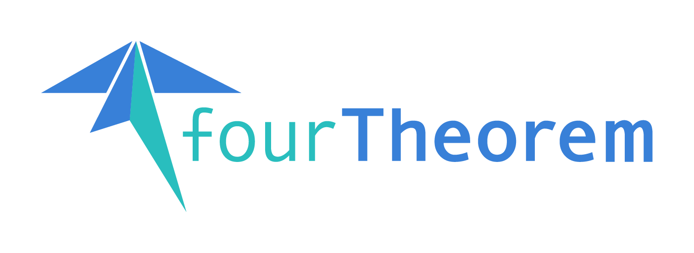

# fourTheorem AWS Enterprise Data mesh Accelerator
A comprehensive solution to get you started on your data strategy using a Data Mesh. 

A Data Mesh is a decentralized method for sharing and managing enterprise data, highlighting data as a product by assigning ownership to domain experts. It promotes federated governance and utilizes a shared data platform, fostering innovation in data-intensive organizations.

This approach tackles common data challenges head-on by distributing data management and ownership. It alleviates strain on centralized data teams, addresses operational database performance issues, diminishes reliance on ETL jobs, enhances data quality and governance, and facilitates accessibility by breaking down data silos.

# Deployment

## Prerequisites and considerations
This accelerator uses multiple accounts 

to do: image on multiple accounts

If you do not already have an AWS presence, then you can use the [fourTheorem AWS Enterprise Cloud Accelerator](https://github.com/fourTheorem/aws-enterprise-cloud-acceleration) to create a *landing zone*, which is a well-architected, multi-account AWS environment based on security and compliance best practices.

