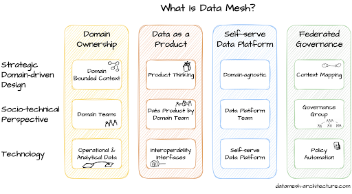
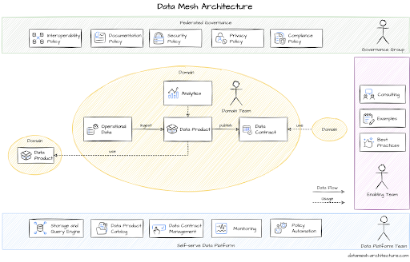

# What is a Data Mesh

**Data Mesh is an architectural framework that solves advanced data security challenges through distributed, decentralised ownership.**  

Organisations have multiple data sources from different lines of business that must be integrated for analytics. A Data Mesh architecture effectively unites disparate data sources and links them together through centrally managed data sharing and governance guidelines. Business functions can control how shared data is accessed, who accesses it, and in what formats it’s accessed. A Data Mesh adds complexities to architecture but also brings efficiency by improving data access, security, and scalability.

## What challenges does Data Mesh solve?
Historically, organisations have often utilised a central team of data engineers for managing data. This model has worked well in the past when there was a limited number of data sources and destinations, e.g. extracting data nightly from an operational system into a data warehouse. However as data volumes and the number of data sources have increased, organisations have struggled to scale their data pipelines because of the following reasons:
1. **Siloed data team:** The central data team consists of specialised data scientists and engineers with limited business and domain knowledge. Despite this, they are responsible for providing data for a wide range of operational and analytical needs, often without fully understanding the rationale behind these needs.
2. **Slow responsiveness to change:** Data engineers typically implement pipelines that ingest the data and transform it over several steps before storing it in a central data lake. Any requested changes require modifications to the entire pipeline. The central team has to make these changes while managing conflicting priorities and with limited business domain knowledge.
3. **Reduced accuracy:** Business units are disconnected from the data consumers and the central data teams. As a result, they lack the incentive to provide meaningful, correct, and useful data.

## What are the benefits of Data Mesh?
Over time, **a data platform architecture could result in frustrated data consumers, disconnected data producers, and an overloaded data management team.** Data Mesh architecture attempts to solve these challenges by empowering business units to have high autonomy and ownership of their data domain. The benefits of Data Mesh architecture include:
- **Democratic data processing:** A Data Mesh transfers data control to domain experts who create meaningful data products within a decentralised governance framework. Data consumers also request access to the data products and seek approvals or changes directly from data owners. As a result, everyone gets faster access to relevant data, and faster access improves business agility.
- **Increased flexibility:** Centralised data infrastructure is more complex and requires collaboration to maintain and modify. Instead, the Data Mesh reorganizes the technical implementation of the central system to the business domains. This removes central data pipelines and reduces operational bottlenecks and technical strains on the system.
- **Cost efficiency:** Distributed data architecture moves away from batch processing, instead promoting real-time data streaming adoption. You improve visibility into resource allocation and storage costs, resulting in better budgeting and reduced costs.
- **Improved data discovery:** A Data Mesh model prevents data silos from forming around central engineering teams. It also reduces the risk of data assets getting locked within different business domain systems. Instead, the central data management framework governs and records the data available in the organisation. For example, domain teams automatically register their data in a central registry.
- **Strengthened security and compliance:** Data Mesh architectures enforce data security policies both within and between domains. They provide centralised monitoring and auditing of the data-sharing process. For example, you can enforce log and trace data requirements on all domains. Your auditors can observe the usage and frequency of data access.

## The 4 principles of Data Mesh
The 4 principles of Data Mesh are shown below:  

Source: https://www.datamesh-architecture.com

Data Mesh is an effective pattern for enterprises that wish to move to a serverless / microservice architecture using Domain Driven Design. It moves some of the responsibility for data from centralised data teams to the **data producers**. This aligns with the first two principles of Data Mesh: **Domain Ownership** and **Data as a Product**. The data producers are the data owners, data is no longer seen as a byproduct of a domain and becomes a first-class citizen of the domain, in the same way that API contracts are.

To enable a Data Mesh strategy, the domain teams need systems and tooling to enable them to publish data. This is where the last two principles of Data Mesh: **Self-serve Data Platform** and **Federated Governance** comes in. These are enabled by a platform team, and allow the data producers to publish data, and to grant access to data. The various roles involved in a Data Mesh strategy are shown below. In many organisations, these roles may be combined.

- **Governance Group**: This is a centralised team that creates the central governance and compliance rules for an organisation.
- **Enabling Team**: The enabling team works as an internal support team to assist with domain teams to publish data to the Data Mesh.
- **Data Platform Team**: The data platform team owns the data platform that allows the domain owners to publish data and the data consumers to access data. This allows for the storage, cataloging and querying of data while also managing the governance and compliance rules defined by the Governance Group and the domain owners (i.e. **Federated Governance**)
- **Domain Team**: The domain team is responsible for creating the data product. This involves defining the meta-data as a **Data Contract**, defining SLA's (e.g. refresh rate, expiry date, etc) and who is allowed access the data (shared responsibility with the **Governance Group**)

